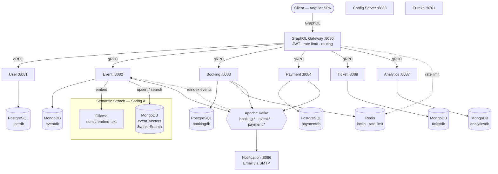
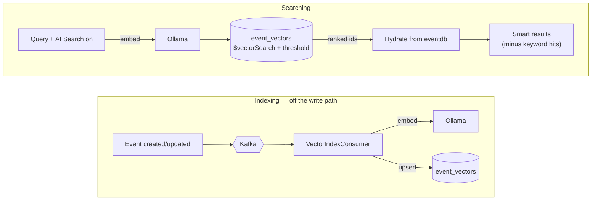
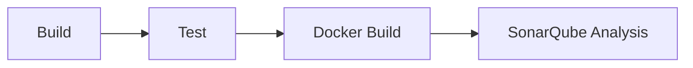

# Booking Platform

A production-grade event booking platform built with Java 21 and Spring Boot microservices, backed by an Angular frontend. The system handles user registration, event management, seat booking with distributed locking, payment processing, ticket generation with automatic cancellation on booking cancellation, email notifications, real-time analytics, and AI-powered **semantic ("smart") event search** — all connected through gRPC, Kafka, and a GraphQL API gateway.

## Architecture



For the runtime request-flow sequences (creating a booking, cancelling with refund, creating an event) and the event lifecycle state machine, see **[Application Flows](docs/wiki/Application%20Flows/application-flows.md)**.

## Services

| Service | Port | gRPC | Database | Description |
|---------|------|------|----------|-------------|
| **graphql-gateway** | 8080 | — | Redis | API gateway with GraphQL, JWT authentication, rate limiting |
| **user-service** | 8081 | 9091 | PostgreSQL | User registration/login via Keycloak, profile management |
| **event-service** | 8082 | 9093 | MongoDB | Event CRUD, seat categories, publishing workflow, semantic "smart" search (Spring AI + Ollama) |
| **booking-service** | 8083 | 9094 | PostgreSQL + Redis | Seat reservation with distributed locking, idempotency |
| **payment-service** | 8084 | 9095 | PostgreSQL | Payment processing, refunds, transactional outbox |
| **notification-service** | 8086 | — | — | Email notifications via Kafka consumers |
| **analytics-service** | 8087 | 9097 | MongoDB | Real-time booking/revenue analytics (REST API at `/api/analytics`) |
| **ticket-service** | 8088 | 9096 | MongoDB | Ticket generation, validation, and cancellation |
| **config-service** | 8888 | — | — | Centralized configuration (Spring Cloud Config) |
| **eureka-service** | 8761 | — | — | Service discovery (Spring Cloud Netflix Eureka) |

## Technology Stack

| Category | Technologies |
|----------|-------------|
| **Language & Runtime** | Java 21, Spring Boot 3.4.1, Spring Cloud 2024.0 |
| **API** | GraphQL (Spring GraphQL), gRPC (protobuf), REST (actuator, analytics) |
| **Frontend** | Angular 17, Apollo Angular, TypeScript |
| **Security** | Keycloak (OAuth2/OIDC), JWT, mTLS for gRPC, rate limiting |
| **Databases** | PostgreSQL, MongoDB, Redis |
| **Messaging** | Apache Kafka (KRaft mode) |
| **AI / Semantic Search** | Spring AI, Ollama (`nomic-embed-text`, local embeddings), MongoDB Atlas `$vectorSearch` |
| **Resilience** | Resilience4j (circuit breaker, retry, bulkhead, time limiter) |
| **Observability** | Prometheus, Grafana, Loki, Zipkin, Micrometer, structured logging |
| **Code Quality** | JaCoCo, SonarQube/SonarCloud |
| **CI/CD** | GitHub Actions (build, test, Docker build, SonarQube analysis) |
| **Containerization** | Docker, Docker Compose (multi-stage builds), Kubernetes (kind / Docker Desktop), Helm, nginx |
| **Schema Management** | Flyway (PostgreSQL migrations) |
| **Build** | Maven (multi-module), Protobuf/gRPC code generation |

## Shared Modules

| Module | Purpose |
|--------|---------|
| `common-proto` | Protobuf/gRPC service definitions shared across services |
| `common-core` | Shared DTOs, exceptions, security config, actuator config |
| `common-grpc-security` | JWT interceptors for gRPC (server + client) |
| `common-events` | Kafka event schemas (booking, event, payment events) |

## Key Patterns & Design Decisions

- **GraphQL Gateway** — Single entry point for all client queries/mutations. Translates GraphQL to gRPC calls, handles authentication, and enforces rate limits per user tier (anonymous, authenticated, search).
- **gRPC for service-to-service** — Binary protocol with strict contracts via protobuf. Optional mTLS for mutual authentication.
- **Event-driven architecture** — Kafka decouples booking, payment, ticket, notification, and analytics flows. Services react to domain events independently.
- **Transactional outbox** — Payment service uses the outbox pattern to guarantee exactly-once event publishing alongside database transactions.
- **Distributed locking** — Redis-based locks prevent double-booking of seats. Combined with idempotency keys to handle retries safely.
- **Ticket lifecycle** — Tickets are generated on `BookingConfirmed` and automatically cancelled on `BookingCancelled`, keeping ticket status always consistent with booking status.
- **Centralized configuration** — Spring Cloud Config Server serves environment-specific properties from a local filesystem (`config/dev/`, `config/prod/`).
- **Service discovery** — Eureka enables services to find each other by name instead of hardcoded addresses.
- **Dead Letter Topics (DLT)** — Failed Kafka messages are routed to dead letter topics for investigation instead of being silently dropped.
- **Structured logging with correlation IDs** — Every request gets a correlation ID that propagates across all services via gRPC metadata and Kafka headers, enabling end-to-end request tracing in Grafana/Loki.
- **Email verification** — Delegated entirely to Keycloak, which sends a branded verification email via MailHog/SMTP and tracks `emailVerified` natively. No custom token storage needed.
- **Semantic search** — event-service returns AI "smart results" matched by *meaning* alongside keyword results, using [Spring AI](https://spring.io/projects/spring-ai) + a local Ollama embedding model. Off by default, resilient (falls back to keyword-only if the model is down). See [Semantic Search](#semantic-search).

## Semantic Search

event-service augments classic keyword search with **semantic "smart results"** — events matched by meaning, not words (searching *"live music show"* also surfaces concerts whose titles never mention those words). It's exposed via `events(... aiSearch: true)` and the frontend's **✨ AI Search** toggle, and is **off by default** (`SEMANTIC_SEARCH_ENABLED`).

- **Embeddings:** [Spring AI](https://spring.io/projects/spring-ai) + **Ollama** running `nomic-embed-text` (local, no API key, no cost).
- **Storage/search:** MongoDB Atlas-local `$vectorSearch` over an `event_vectors` collection in the same MongoDB.
- **Additive results:** smart results exclude anything keyword search already returned ("what you'd have missed"), filtered by a tunable similarity threshold.
- **Resilient:** if Ollama is unavailable, search degrades gracefully to keyword-only. Indexing is decoupled via Kafka with retries → DLT.



See **[INSTALLATION.md → Semantic Search](docs/wiki/INSTALLATION.md#semantic-search)** for setup and tuning.

## GraphQL API

The gateway exposes a GraphQL endpoint at `http://localhost:8080/graphql`. Available operations:

### Queries

**Users**
- `me` — Get authenticated user profile
- `user(id)` — Get user by ID (admin only)
- `users(query, page, pageSize)` — Search users (admin only)

**Events**
- `event(id)` — Get event details (public)
- `events(query, category, city, dateFrom, dateTo, page, pageSize, organizerId, aiSearch)` — Search events (public). With `aiSearch: true`, the response's `smartResults` also returns semantic matches the keyword search missed (see [Semantic Search](#semantic-search)).

**Bookings**
- `booking(id)` — Get booking details (own bookings)
- `myBookings(page, pageSize, status)` — List own bookings with optional status filter

**Tickets**
- `myTickets(page, pageSize)` — List own tickets (extracted from JWT)
- `ticket(ticketNumber)` — Get a single ticket by number (employee only)
- `ticketsByBooking(bookingId)` — All tickets for a booking (employee only)
- `ticketsByUser(userId, page, pageSize)` — All tickets for a user (employee only)

### Mutations

**Auth**
- `register` / `login` / `logout` / `refreshToken` — Authentication

**Profile**
- `updateProfile` — Update user profile

**Events** (employees only)
- `createEvent` / `updateEvent` / `publishEvent` / `cancelEvent` — Event management

**Bookings**
- `createBooking` / `cancelBooking` — Booking operations

**Tickets** (employees only)
- `validateTicket(ticketNumber)` — Mark ticket as USED at venue entry
- `cancelTicket(ticketNumber)` — Mark ticket as CANCELLED

### Example: Browse Events and Book

```graphql
# Browse published events (no auth needed)
query {
  events(city: "Amsterdam", pageSize: 5) {
    events {
      id
      title
      category
      dateTime
      venue { name city country }
      seatCategories { name price currency availableSeats }
    }
    totalCount
    totalPages
  }
}

# Login (returns JWT tokens)
mutation {
  login(input: {
    username: "john.doe"
    password: "customer123"
  }) {
    accessToken
    refreshToken
    expiresIn
    user { id username roles }
  }
}

# Create booking (requires Authorization: Bearer <token>)
mutation {
  createBooking(input: {
    eventId: "<event-id>"
    seatCategory: "VIP"
    quantity: 2
    idempotencyKey: "<client-generated-uuid>"
  }) {
    id
    status
    totalPrice
    currency
  }
}

# Check your tickets after booking is confirmed
query {
  myTickets(pageSize: 10) {
    tickets {
      ticketNumber
      eventTitle
      seatCategory
      status
    }
  }
}
```

## Frontend

An Angular 17 single-page application lives in `frontend/`. It connects to the GraphQL gateway via Apollo Angular and supports:

- **Public** — Browse and search events by category, city, or keyword, with an optional **✨ AI Search** toggle that adds semantic "smart results"
- **Customers** — Register, login, book seats, view bookings (Upcoming / Past), view tickets with QR codes, cancel bookings, manage profile
- **Organizers** (`employee` role) — Dashboard with stats, create/edit/publish/cancel events, scan and validate tickets at the door

```bash
cd frontend
npm install
npm start          # dev server at http://localhost:4200
```

API calls are proxied to `http://localhost:8080` via `proxy.conf.json`. See **[docs/frontend-guide.md](docs/wiki/Frontend/frontend-guide.md)** for a full walkthrough.

## Getting Started

### Quick Start (Docker)

```bash
git clone <repository-url>
cd booking-platform
docker compose -f infrastructure/docker/docker-compose.yaml up --build -d
```

This starts all infrastructure and services. The GraphQL gateway will be available through nginx at `http://localhost/graphql` and the GraphiQL playground at `http://localhost/graphiql`.

### Quick Start (Kubernetes)

Requires a running Kubernetes cluster (kind or Docker Desktop with Kubernetes enabled) and `helm`.

```bash
git clone <repository-url>
cd booking-platform

# Fill in your secrets (gitignored)
# Edit infrastructure/k8s/.env.k8s with your values

# Start everything
./infrastructure/k8s/run.sh
```

The script builds all service images, loads them into the cluster, installs infrastructure via Helm, and deploys all services in dependency order. On subsequent runs it skips already-healthy Helm releases and only re-applies changed manifests.

To access the GraphQL gateway from the Angular frontend, port-forward it locally:

```bash
kubectl port-forward svc/graphql-gateway 8080:8080 -n booking-platform
cd frontend && npm start   # proxies /graphql → localhost:8080
```

### Full Setup

See **[INSTALLATION.md](docs/wiki/INSTALLATION.md)** for detailed instructions including:
- Local development setup (services on host with hot-reload)
- Local development setup (services on host with hot-reload)
- Full Docker deployment
- Kubernetes deployment (local cluster with kind or Docker Desktop)
- Frontend development server
- Environment variables and config server
- Keycloak setup and test users
- mTLS certificate generation
- Observability stack (Grafana, Prometheus, Zipkin)
- Semantic search setup and tuning (Spring AI + Ollama)
- SonarQube code quality analysis
- Postman collections for API testing

## Infrastructure

| Component | Port | Purpose |
|-----------|------|---------|
| PostgreSQL | 5432 | Relational data (user, booking, payment) |
| MongoDB | 27017 | Document data (events, tickets, analytics) |
| Redis | 6379 | Distributed locks, rate limiting cache |
| Kafka | 9092 | Event streaming between services |
| Ollama | 11434 | Local embedding model (`nomic-embed-text`) for semantic search |
| Keycloak | 8180 | OAuth2/OIDC identity provider |
| nginx | 80 | Reverse proxy (Docker deployment only) |
| Zipkin | 9411 | Distributed tracing |
| Prometheus | 9090 | Metrics collection |
| Grafana | 3000 | Dashboards (metrics, logs, traces) |
| Loki | 3100 | Log aggregation |
| Mongo Express | 8090 | MongoDB web UI |
| RedisInsight | 5540 | Redis web UI |
| MailHog | 8025 | Email testing UI |
| Kafka UI | 8085 | Kafka topic browser |
| SonarQube | 9000 | Code quality (local) |

## CI Pipeline

GitHub Actions runs automatically on every push to `main` and pull request:



- **Build** — Compiles all modules (Java 21, Temurin)
- **Test** — Runs unit and integration tests with JaCoCo coverage (Testcontainers for database/messaging tests)
- **Docker Build** — Validates the shared Dockerfile builds successfully
- **SonarQube** — Uploads coverage and static analysis to SonarCloud

## Project Structure

```
booking-platform/
├── common/                          # Shared modules
│   ├── common-proto/                #   Protobuf/gRPC definitions
│   ├── common-core/                 #   Shared DTOs, security, exceptions
│   ├── common-grpc-security/        #   gRPC JWT interceptors
│   └── common-events/               #   Kafka event schemas
├── services/
│   ├── config-service/              # Spring Cloud Config Server
│   ├── eureka-service/              # Service Discovery
│   ├── graphql-gateway/             # GraphQL API Gateway
│   ├── user-service/                # User management + Keycloak
│   ├── event-service/               # Event management
│   ├── booking-service/             # Booking with distributed locking
│   ├── payment-service/             # Payment processing + outbox
│   ├── ticket-service/              # Ticket generation + cancellation
│   ├── notification-service/        # Email notifications
│   └── analytics-service/           # Real-time analytics (REST API)
├── frontend/                        # Angular 17 SPA
│   ├── src/app/
│   │   ├── core/                    #   Auth service + guards
│   │   ├── shared/                  #   GraphQL documents, models, components
│   │   └── features/                #   Auth, events, bookings, tickets, organizer
│   └── proxy.conf.json              # Dev proxy → GraphQL gateway
├── config/
│   ├── dev/                         # Development properties (per service)
│   └── prod/                        # Production properties
├── infrastructure/
│   ├── docker/                      # Docker Compose + shared Dockerfile
│   │   ├── docker-compose.yaml            #   Wrapper (infra + services + nginx)
│   │   ├── docker-compose.startup.yaml    #   Infra (Postgres, Mongo, Redis, Kafka, Ollama, Keycloak, observability)
│   │   ├── docker-compose.services.yaml   #   Application services
│   │   ├── Dockerfile.service             #   Shared multi-stage build for all services
│   │   └── postgres/init-multiple-dbs.sh  #   Creates userdb/bookingdb/paymentdb/eventdb
│   ├── k8s/                         # Kubernetes manifests
│   │   ├── run.sh                   #   Single script — starts the entire platform
│   │   ├── .env.k8s                 #   Secrets (gitignored)
│   │   ├── namespace.yaml           #   booking-platform namespace
│   │   ├── common/                  #   Shared ConfigMap (env vars for all services)
│   │   ├── helm/                    #   Helm values for infra (postgres, mongo, redis, kafka, keycloak)
│   │   ├── infrastructure/          #   Direct k8s manifests for zipkin, mailhog, kafka, keycloak
│   │   ├── services/                #   Per-service configmap + deployment + service
│   │   └── ingress/                 #   Ingress routing rules
│   ├── certs/                       # mTLS certificate generation
│   ├── grafana/                     # Grafana dashboards and datasources
│   ├── keycloak/                    # Keycloak themes
│   ├── nginx/                       # nginx reverse proxy config
│   ├── prometheus/                  # Prometheus scrape config
│   ├── promtail/                    # Log collection config
│   └── sonarqube/                   # SonarQube analysis script
├── init/                            # Baseline state for fresh installs
│   ├── keycloak/                    #   Keycloak realm JSON (auto-imported by Docker)
│   └── migrations/                  #   SQL migration reference scripts
├── postman/                         # Postman collections for API testing
├── docs/                            # Guides and reference docs
│   ├── frontend-guide.md            #   Angular app walkthrough
│   └── error-codes.md               #   Structured error code reference
├── release/                         # Release tooling
│   └── scripts/release-manager.sh   #   Version bump, changelog, tagging
├── .github/workflows/ci.yml         # CI pipeline
├── run-service.sh                   # Run one service on the host (sources .env)
├── start-all.sh                     # Start every service (tmux session)
├── build-service.sh                 # Build a single service image
├── mvnw / mvnw.cmd                  # Maven wrapper
├── README.md                        # This file
├── INSTALLATION.md                  # Detailed setup & operations guide
├── SECURITY.md                      # Security policy
├── LICENSE                          # License
├── .env                             # Local env overrides (gitignored)
├── .gitignore / .gitattributes / .dockerignore
└── pom.xml                          # Root Maven POM (multi-module)
```
