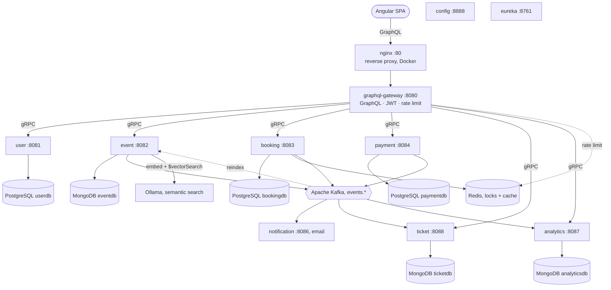

# Ticketing Platform

A production-grade **event ticketing platform** built with Java 21 and Spring Boot microservices, fronted by an Angular single-page app. It handles registration and login (via Keycloak), event management with a publishing workflow, seat booking under distributed locks, payment processing (Stripe or a mock gateway), QR ticket generation, email notifications, real-time analytics, and AI-powered **semantic ("smart") event search** — all wired together with gRPC, Kafka, and a single GraphQL gateway.

> 📚 **Full documentation lives in the [Wiki](../../wiki).** This README is the map; the wiki has the territory.

## Architecture



The Angular SPA talks only to the GraphQL gateway; the gateway fans out to the domain services over gRPC; services react to each other asynchronously through Kafka. Full detail: **[Architecture overview](../../wiki/architecture-overview)** · **[Communication patterns](../../wiki/communication-patterns)** · **[Application flows](../../wiki/application-flows)**.

## Services

| Service | HTTP | gRPC | Store | Role |
|---------|------|------|-------|------|
| [graphql-gateway](../../wiki/graphql-gateway) | 8080 | — | Redis | Single client API; GraphQL → gRPC, auth, rate limiting |
| [user-service](../../wiki/user-service) | 8081 | 9091 | PostgreSQL | Auth + profiles via Keycloak |
| [event-service](../../wiki/event-service) | 8082 | 9093 | MongoDB | Events, publishing, keyword + semantic search |
| [booking-service](../../wiki/booking-service) | 8083 | 9094 | PostgreSQL + Redis | Seat reservation, cart, lovelist |
| [payment-service](../../wiki/payment-service) | 8084 | 9095 | PostgreSQL | Payments, refunds, outbox |
| [ticket-service](../../wiki/ticket-service) | 8088 | 9096 | MongoDB | Ticket issue / validate / cancel |
| [notification-service](../../wiki/notification-service) | 8086 | — | — | Email from Kafka events |
| [analytics-service](../../wiki/analytics-service) | 8087 | 9097 | MongoDB | Booking/revenue analytics (REST) |
| [config-service](../../wiki/config-service) | 8888 | — | — | Spring Cloud Config server |
| [eureka-service](../../wiki/eureka-service) | 8761 | — | — | Service discovery |

Shared libraries (`common-proto`, `common-events`, `common-core`, `common-security`) are described in **[Shared modules](../../wiki/shared-modules)**.

## Technology stack

| Category | Technologies |
|----------|-------------|
| Language & runtime | Java 21, Spring Boot 3.4.1, Spring Cloud 2024.0 |
| APIs | GraphQL (Spring GraphQL), gRPC (protobuf), REST (actuator, analytics) |
| Frontend | Angular 22, Apollo Angular 14, TypeScript 6, Stripe.js 9 |
| Identity | Keycloak (OAuth2/OIDC), JWT, per-tier rate limiting, optional gRPC mTLS |
| Datastores | PostgreSQL, MongoDB, Redis |
| Messaging | Apache Kafka (KRaft), protobuf payloads, dead-letter topics |
| AI / search | Spring AI, Ollama `nomic-embed-text`, MongoDB `$vectorSearch` |
| Observability | Prometheus, Grafana, Loki + Promtail, Zipkin, correlation IDs |
| Quality & CI | JaCoCo, SonarCloud, GitHub Actions |
| Packaging | Maven (multi-module), Docker Compose, Kubernetes + Helm, nginx |

## Quick start

### Docker (everything, one command)

```bash
docker compose -f infrastructure/docker/docker-compose.yaml up --build -d
```

GraphQL is served through nginx at `http://localhost/graphql`, GraphiQL at `http://localhost/graphiql`.

### Kubernetes (local cluster)

```bash
# Fill in infrastructure/k8s/.env.k8s (gitignored), then:
./infrastructure/k8s/run.sh
kubectl port-forward svc/graphql-gateway 8080:8080 -n booking-platform
```

### Services on the host (development)

```bash
docker compose -f infrastructure/docker/docker-compose.startup.yaml up -d   # backing services
./infrastructure/certs/generate-certs.sh                                    # or GRPC_MTLS_ENABLED=false
./start-all.sh                                                              # services in order (tmux)
```

### Frontend

```bash
cd frontend
npm install --legacy-peer-deps
npm start          # http://localhost:4200, proxies /graphql → gateway
```

Full setup — `.env`, Keycloak, certificates, semantic search, observability, Postman — is in the **[Installation guide](../../wiki/INSTALLATION)**.

## Example: browse events and book

```graphql
# Public — no auth
query { events(city: "Amsterdam", pageSize: 5) {
  events { id title dateTime venue { name city } seatCategories { name price availableSeats } }
  totalCount
} }

# Login → returns JWT
mutation { login(input: { username: "john.doe", password: "customer123" }) {
  accessToken user { id username roles }
} }

# Create booking — Authorization: Bearer <token>
mutation { createBooking(input: {
  eventId: "<event-id>", seatCategory: "VIP", quantity: 2, idempotencyKey: "<uuid>"
}) { id status totalPrice currency } }
```

The full GraphQL surface (users, events, bookings, cart, lovelist, payments, tickets, organizer stats) is in the [graphql-gateway](../../wiki/graphql-gateway) page and the [Postman collections](../../wiki/INSTALLATION).

## Documentation

Everything below is in the **[Wiki](../../wiki)**:

- **Architecture** — [overview](../../wiki/architecture-overview) · [communication patterns](../../wiki/communication-patterns) · [application flows](../../wiki/application-flows)
- **Services** — [overview](../../wiki/services-overview) and a page per service; [shared modules](../../wiki/shared-modules) · [configuration](../../wiki/configuration)
- **Infrastructure** — [overview](../../wiki/infrastructure-overview) · [Docker](../../wiki/docker-deployment) · [Kubernetes](../../wiki/kubernetes-deployment) · [observability](../../wiki/observability)
- **Operations** — [build & run](../../wiki/build-and-run) · [using the app](../../wiki/using-the-app) · [releases](../../wiki/releases) · [CI/CD](../../wiki/ci-cd)
- **Frontend** — [guide](../../wiki/frontend-guide) · **Reference** — [error codes](../../wiki/error-codes) · [payment test cards](../../wiki/payment-test-cards)

Docs are authored in [`docs/wiki/`](docs/wiki) and published to the GitHub Wiki automatically (see [CI/CD](../../wiki/ci-cd)).

## Repository layout

```
ticketing-platform/
├── common/            # shared modules: common-proto, common-events, common-core, common-security
├── services/          # the 10 Spring Boot services
├── frontend/          # Angular 22 SPA
├── config/            # per-environment properties (dev/, prod/) served by config-service
├── infrastructure/    # docker/, k8s/, certs/, keycloak/, nginx/, observability, sonarqube
├── init/              # fresh-install baseline (Keycloak realm, migration reference)
├── release/           # versioned release manager (Keycloak upgrades); Flyway handles SQL
├── postman/           # Postman collections
├── docs/wiki/         # documentation (published to the GitHub Wiki)
├── .github/workflows/ # ci.yml, sync-wiki.yml
├── build-service.sh · run-service.sh · start-all.sh   # dev helpers
├── README.md · SECURITY.md · mvnw · pom.xml
```

## Security

See **[SECURITY.md](SECURITY.md)** for the security model (Keycloak identity, JWT, mTLS, rate limiting, actuator lockdown) and how to report a vulnerability.

## License

See [LICENSE](LICENSE).
