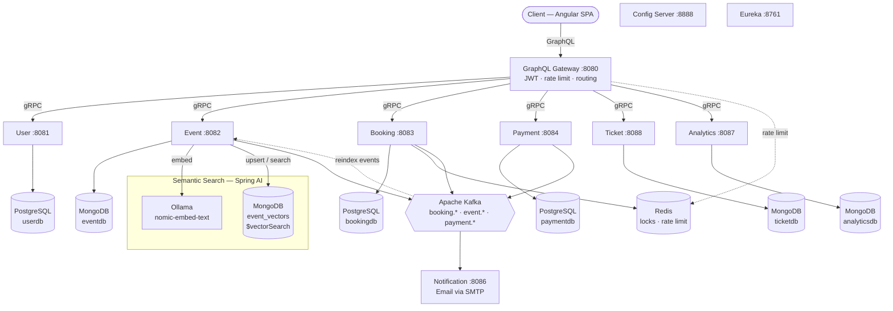
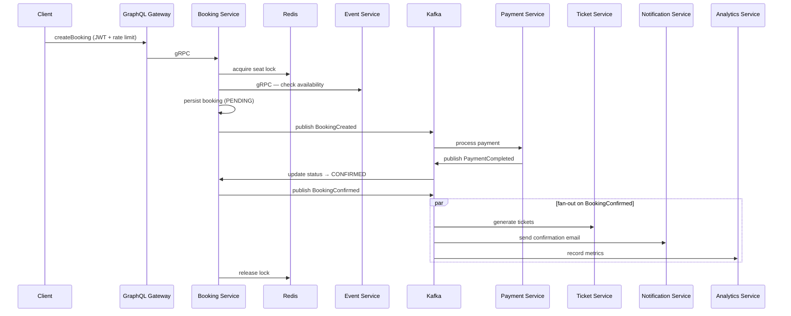
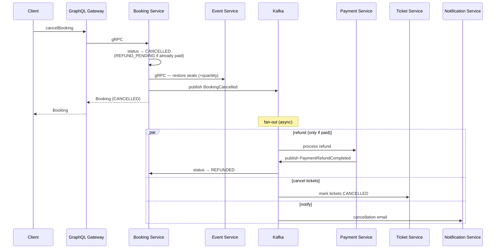
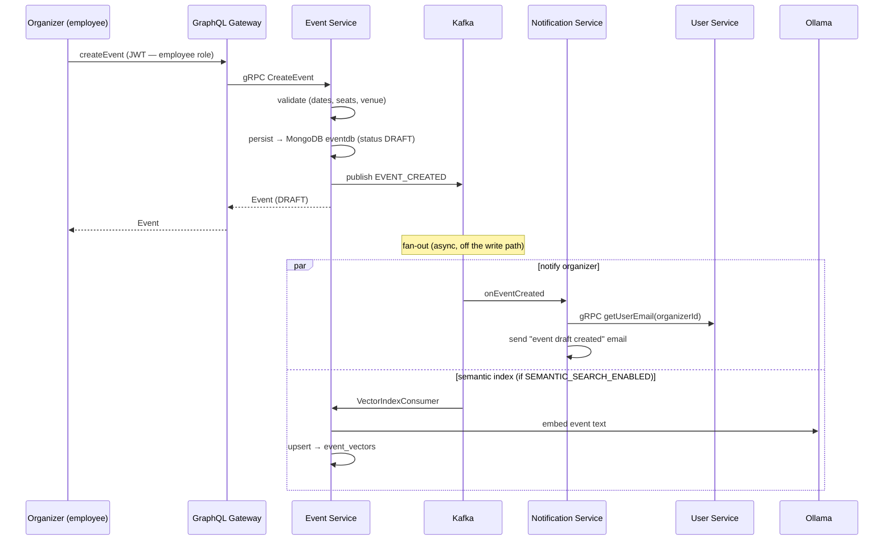
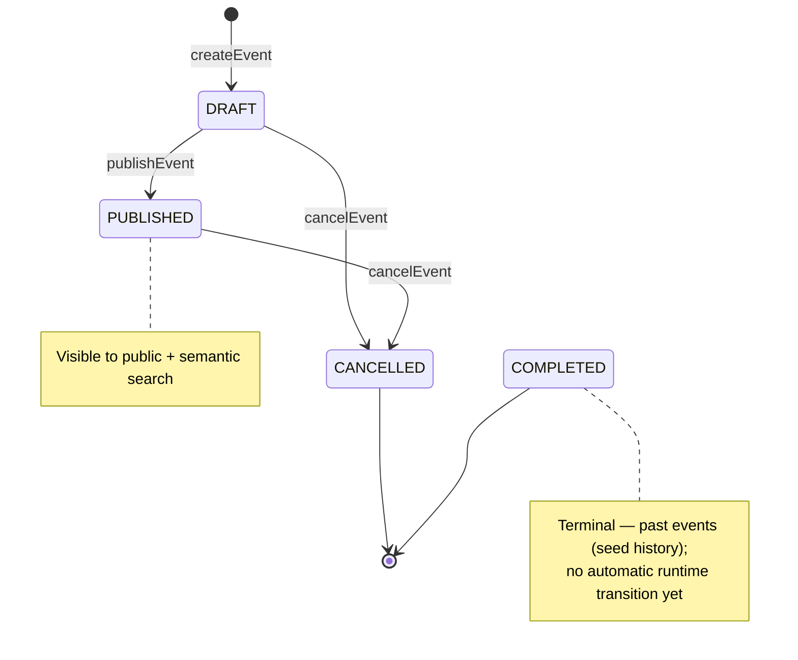

# Application Flows

These diagrams describe the Booking Platform's architecture and its main runtime flows. The request-flow sequences and event lifecycle were moved out of the README to keep the front page concise (the README keeps the top-level architecture diagram).

## Architecture

## Request Flow: Creating a Booking

## Request Flow: Cancelling a Booking (with refund)

Cancellation is the reverse saga. The booking is marked cancelled and seats are restored synchronously; the refund, ticket cancellation, and notification happen asynchronously off `BookingCancelled`. A paid booking follows `CANCELLED → REFUND_PENDING → REFUNDED`.

> **Payment failure (unhappy path):** if the payment **fails** during booking, payment-service emits `PaymentFailed`; booking-service marks the booking failed (releasing the reserved seats) and notification-service emails the user. The booking is never confirmed and no ticket is generated.

## Request Flow: Creating an Event

An organizer (`employee` role) creates an event. The write path is synchronous and simple — validate, persist as `DRAFT`, publish one event — while the side effects (organizer email, semantic indexing) happen asynchronously off the Kafka event, so the API responds immediately.

## Event Lifecycle

An event moves through a small state machine. Only `DRAFT` events can be **published**; only `DRAFT` or `PUBLISHED` events can be **cancelled**. Every transition emits a Kafka event consumed by notification-service (organizer email) and analytics-service, and drives the semantic index in event-service (create/publish → index, cancel → remove).

- **`DRAFT → PUBLISHED`** (`publishEvent` → `EVENT_PUBLISHED`) — makes the event visible to public and semantic search.
- **`DRAFT → CANCELLED`** — cancels a draft that was never public (removes its vector if it was indexed).
- **`PUBLISHED → CANCELLED`** — pulls a live event from search (`EVENT_CANCELLED` → removed from the vector store, organizer notified). Note: this does **not** auto-cancel existing bookings.
- **`COMPLETED`** — terminal status for past events; currently only produced by seed data (no scheduled job transitions live events to it yet).
