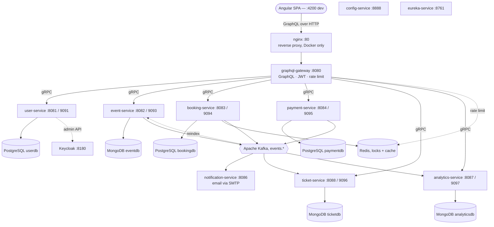

# Architecture Overview

The Booking Platform is a **Spring Boot microservices** system for event ticketing: users browse and search events, reserve seats under distributed locks, pay (Stripe or a mock gateway), receive QR tickets, and get email notifications — while organizers manage events, validate tickets, and read per-event statistics. An **Angular** single-page app is the only client, and it talks to a single **GraphQL gateway** that fans out to the domain services over **gRPC**. Services communicate asynchronously through **Apache Kafka**, and identity is delegated to **Keycloak**.

## System diagram

Runtime request/response sequences (booking, cancel-with-refund, event creation) and the event state machine live in **[Application flows](application-flows)**.

## The two communication planes

The platform deliberately separates **synchronous** request/response from **asynchronous** domain events. See **[Communication patterns](communication-patterns)** for the full detail.

| Plane | Transport | Used for |
|-------|-----------|----------|
| **Synchronous** | GraphQL (client → gateway), gRPC (gateway → services, service → service) | Reads and commands that need an immediate answer — fetch an event, create a booking, get a payment intent |
| **Asynchronous** | Apache Kafka (protobuf messages on `events.*` topics) | Domain events that fan out to independent consumers — confirm a booking → issue tickets, send email, update analytics, reindex for search |

Everything the browser sees goes through the gateway; the domain services have **no public HTTP surface** (the two REST endpoints that exist — the Stripe webhook and the analytics API — are internal/administrative).

## Services at a glance

| Service | HTTP | gRPC | Store | Responsibility |
|---------|------|------|-------|----------------|
| [graphql-gateway](graphql-gateway) | 8080 | — | Redis | Single API entry point; GraphQL → gRPC translation, auth, rate limiting |
| [user-service](user-service) | 8081 | 9091 | PostgreSQL | Registration/login via Keycloak, profiles, unverified-user cleanup |
| [event-service](event-service) | 8082 | 9093 | MongoDB | Event CRUD, publishing workflow, keyword + semantic search |
| [booking-service](booking-service) | 8083 | 9094 | PostgreSQL + Redis | Seat reservation with distributed locking, cart, lovelist |
| [payment-service](payment-service) | 8084 | 9095 | PostgreSQL | Payments/refunds via Stripe or mock, transactional outbox |
| [ticket-service](ticket-service) | 8088 | 9096 | MongoDB | Ticket generation, validation, cancellation |
| [notification-service](notification-service) | 8086 | — | — | Email notifications from Kafka events |
| [analytics-service](analytics-service) | 8087 | 9097 | MongoDB | Booking/revenue analytics, REST `/api/analytics` |
| [config-service](config-service) | 8888 | — | — | Spring Cloud Config server |
| [eureka-service](eureka-service) | 8761 | — | — | Service discovery |

Full per-service pages start at **[Services overview](services-overview)**. Shared libraries are documented in **[Shared modules](shared-modules)**.

## Key design decisions

- **GraphQL gateway as BFF** — one schema for the SPA; the gateway authenticates, enforces per-tier rate limits, and translates each field into gRPC calls. Backend proto changes are invisible to clients until the gateway threads them through.
- **gRPC between services** — strict protobuf contracts, optional mutual TLS. Definitions are shared in [`common-proto`](shared-modules).
- **Event-driven core** — Kafka decouples booking, payment, ticket, notification, and analytics. A confirmed booking is one event that four consumers react to independently.
- **Transactional outbox** — payment-service writes domain events to an outbox table inside the same DB transaction, then a poller publishes them to Kafka, guaranteeing the event fires if and only if the payment committed.
- **Distributed locking + idempotency** — Redis locks serialize seat updates; client-supplied idempotency keys make booking creation safe to retry.
- **Ticket lifecycle mirrors booking** — tickets are issued on `booking.confirmed` and cancelled on `booking.cancelled`, so ticket status is always consistent with the booking.
- **Centralized config + discovery** — [config-service](config-service) serves per-environment properties; [eureka-service](eureka-service) lets services resolve each other by name.
- **Dead-letter topics** — every Kafka consumer routes poison messages to a `-dlt` topic instead of dropping them.
- **Correlation IDs everywhere** — one ID per request propagates across gRPC metadata and Kafka headers into the logs, giving end-to-end tracing in Grafana/Loki. See [Observability](observability).
- **Identity delegated to Keycloak** — the app never stores passwords; email verification and token revocation are Keycloak-native.
- **Semantic search, off the write path** — event-service adds AI "smart results" via Spring AI + a local Ollama model and MongoDB `$vectorSearch`; indexing happens asynchronously over Kafka and degrades to keyword-only if the model is down.

## Technology stack

| Category | Technologies |
|----------|-------------|
| Language & runtime | Java 21, Spring Boot 3.4.1, Spring Cloud 2024.0 |
| APIs | GraphQL (Spring GraphQL), gRPC (`net.devh` starter, protobuf), REST (actuator, analytics, Stripe webhook) |
| Frontend | Angular 22, Apollo Angular 14, TypeScript 6, Stripe.js 9 — see [Frontend guide](frontend-guide) |
| Identity | Keycloak (OAuth2/OIDC), JWT, per-tier rate limiting |
| Datastores | PostgreSQL (user, booking, payment), MongoDB (event, ticket, analytics), Redis (locks, cache, rate limit) |
| Messaging | Apache Kafka (KRaft mode), protobuf message payloads |
| AI / search | Spring AI, Ollama `nomic-embed-text`, MongoDB `$vectorSearch` |
| Resilience | Resilience4j, ShedLock (scheduler locking), Flyway (SQL migrations) |
| Observability | Micrometer → Prometheus, Grafana, Loki + Promtail, Zipkin |
| Quality & CI | JaCoCo, SonarCloud, GitHub Actions |
| Packaging | Maven multi-module, Docker (multi-stage), Docker Compose, Kubernetes + Helm, nginx |

## Where to go next

- **Run it:** [Installation](INSTALLATION) · [Build and run](build-and-run)
- **Use it:** [Using the app](using-the-app) · [Frontend guide](frontend-guide)
- **Understand it:** [Services overview](services-overview) · [Communication patterns](communication-patterns) · [Application flows](application-flows)
- **Operate it:** [Infrastructure overview](infrastructure-overview) · [Observability](observability) · [CI/CD](ci-cd) · [Releases](releases)
