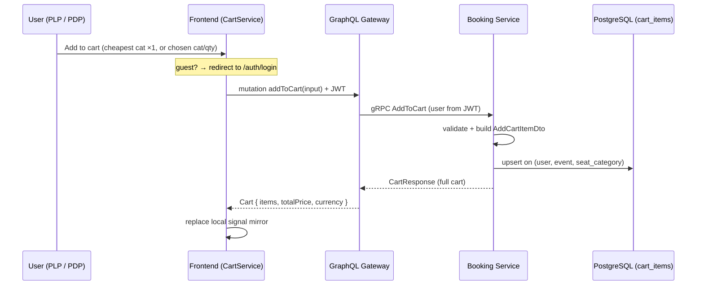
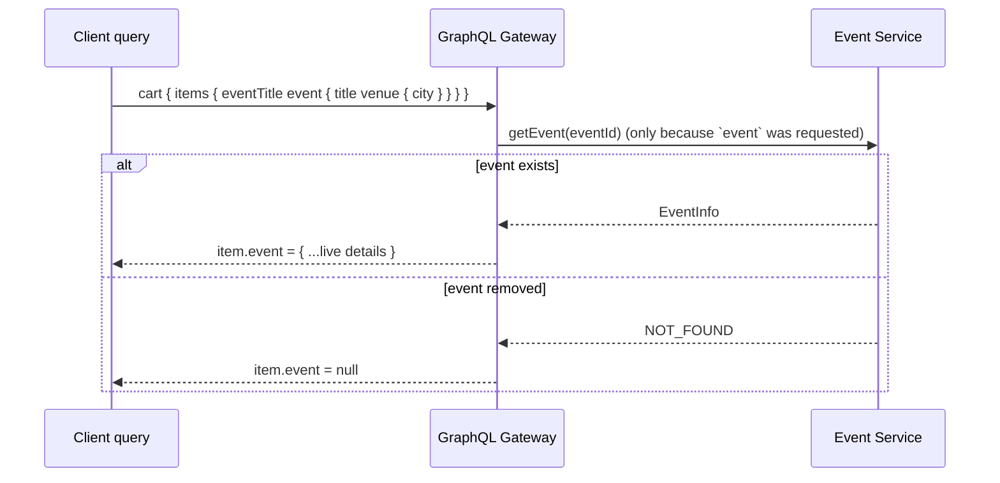
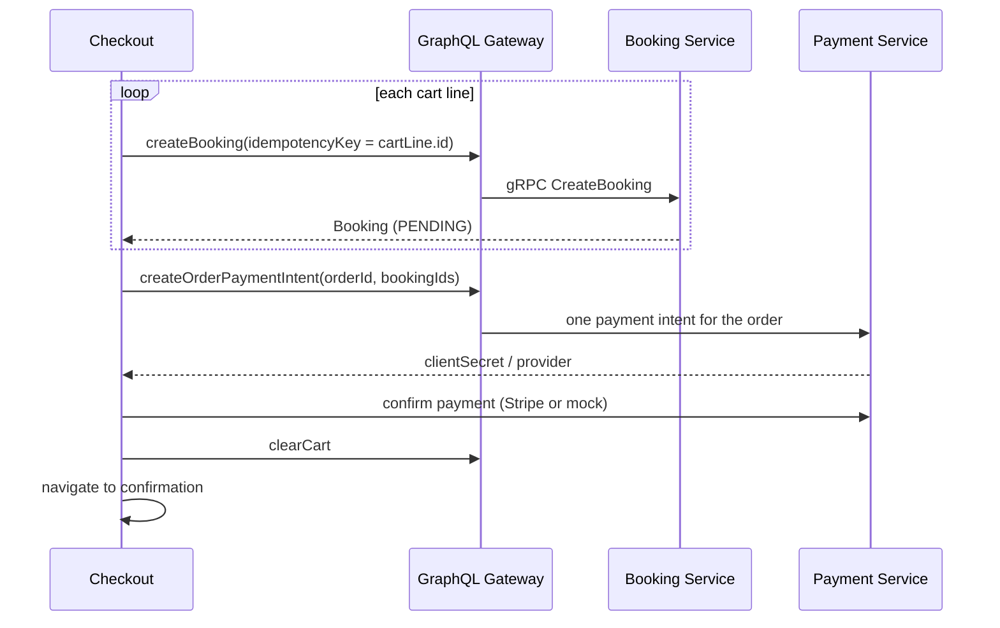

# Cart Flow

The cart is **per-user and server-owned**: it lives in booking-service (PostgreSQL) and is
reached through the GraphQL gateway. The Angular frontend keeps a local signal that mirrors the
server state — every mutation returns the full cart, which replaces the mirror.

- **Owner:** booking-service, table `cart_items`, keyed by the JWT user.
- **Upsert:** a line is unique on `(user_id, event_id, seat_category)` — re-adding the same line
  updates its quantity instead of duplicating it.
- **Auth:** the user is always taken from the JWT (`GrpcUserContext`), never from the request.
  Guests who tap *Add to cart* are redirected to login.
- **Snapshot vs live:** each line stores a price/title snapshot (so it can be rendered and checked
  out), and also exposes a live `event` field hydrated from event-service on demand.

## Add to cart

The same path backs `updateCartItem` (by cart-line id), `removeFromCart` (by cart-line id) and
`clearCart`. Each returns the whole updated cart.

## Live event hydration

The cart's stored fields are a snapshot. When a query asks for `CartItem.event`, the gateway
hydrates live details from event-service — lazily (only when requested) and null-safe (if the
event was deleted, the field is `null`, the rest of the cart still renders).

## Checkout uses the cart

Checkout turns the server cart into bookings and one payment. The **stable cart-line id is used as
each booking's idempotency key**, so reloading checkout reuses the same bookings (no duplicate seat
holds). A fresh `orderId` keys the single order payment.

See also: [Lovelist Flow](lovelist-flow.md) · [Overview](overview.md).
