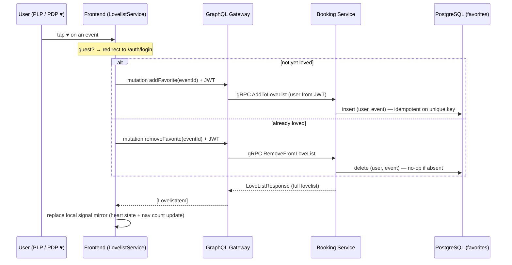
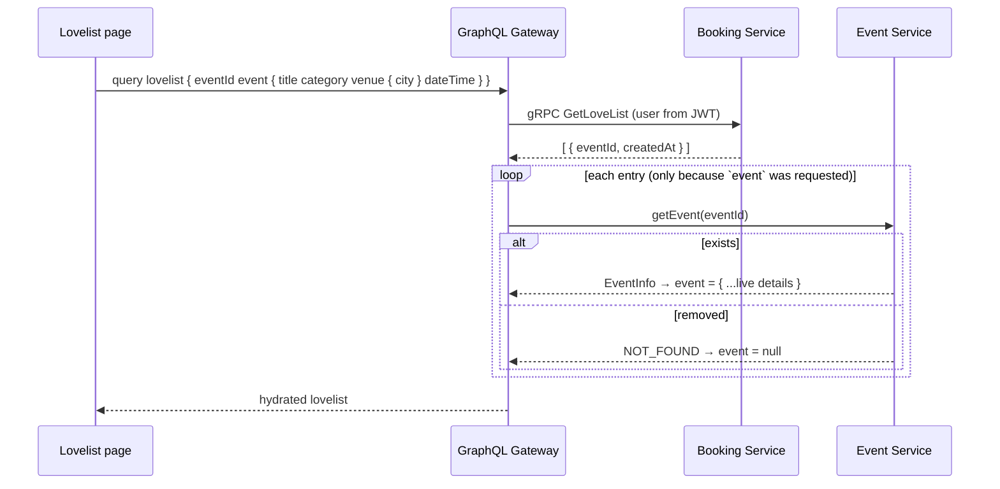

# Lovelist (Favorites) Flow

The lovelist is a **per-user list of favorited events**, owned by booking-service (PostgreSQL) and
reached through the GraphQL gateway. Unlike the cart, a favorite is a **pure pointer** —
`(user_id, event_id)` — with no denormalized event fields; everything shown on screen is hydrated
live from event-service, so a favorite never goes stale.

- **Owner:** booking-service, table `favorites`, unique on `(user_id, event_id)`.
- **Idempotent:** adding an event that's already favorited is a no-op that returns the existing row
  (and is safe under concurrent double-clicks — the unique constraint is caught and the existing
  row is returned).
- **Auth:** user comes from the JWT. Guests who tap ♥ are redirected to login.
- **Response shape:** every mutation returns the **full updated lovelist**, so the frontend mirror
  is always fresh in one round trip.

## Toggle a favorite

## Lovelist page (hydrated)

The Lovelist page lists loved events with their live details. Each entry's `event` field is
hydrated from event-service on demand; if an event was removed, the row shows a graceful
"no longer available" fallback instead of failing the query.

See also: [Cart flow](cart-flow) · [Overview](overview).
