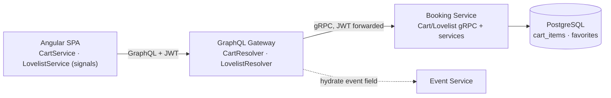

# Cart & Lovelist — Feature Overview

Per-user **Cart** and **Lovelist** (favorites), persisted server-side and surfaced across the
events listing (PLP), event detail (PDP), a cart page, and a lovelist page. This replaced the old
client-only (localStorage) cart with durable, per-user storage, and added favorites from scratch.

## At a glance

| Concern | Cart | Lovelist |
|---|---|---|
| Owner | booking-service (PostgreSQL) | booking-service (PostgreSQL) |
| Table | `cart_items` | `favorites` |
| Uniqueness | `(user_id, event_id, seat_category)` — upsert | `(user_id, event_id)` — idempotent |
| Stored data | price/title snapshot + quantity | pure pointer (event id only) |
| Display data | snapshot, plus live `event` on demand | fully hydrated from event-service |
| Auth | JWT (guests → login) | JWT (guests → login) |

## Architecture

- **User identity** flows JWT → gateway → gRPC context; booking-service reads it from
  `GrpcUserContext` and never trusts a user id in the request.
- **Mutations return the full collection** (cart or lovelist), so the frontend mirror stays fresh
  in a single round trip.
- **Event details are hydrated lazily** at the gateway via `@SchemaMapping` on the `event` field —
  only fetched when queried, and `null` if the event was removed.

## Data model (Flyway `V3`)

- `cart_items` — `id, user_id, event_id, event_title, seat_category, quantity, unit_price,
  currency, created_at, updated_at, version`; unique `(user_id, event_id, seat_category)`.
- `favorites` — `id, user_id, event_id, created_at`; unique `(user_id, event_id)`.

## GraphQL API

| Type | Operation |
|---|---|
| Query | `cart`, `lovelist` |
| Mutation | `addToCart`, `updateCartItem`, `removeFromCart`, `clearCart` |
| Mutation | `addFavorite`, `removeFavorite` |

`CartItem.event` and `LovelistItem.event` resolve to live event details on demand.

## Key design decisions

- **Cart = snapshot, Lovelist = pointer.** Cart lines keep a price/title snapshot so the cart is
  self-sufficient for display and checkout; favorites store only the event reference and hydrate
  everything live (nothing to go stale).
- **Add-to-cart is an upsert**, add-favorite is **idempotent** (and concurrency-safe — a unique
  violation is caught and the existing row returned).
- **Checkout idempotency uses the cart-line id** as each booking's idempotency key, so a checkout
  reload reuses the same bookings (no duplicate seat holds); a fresh `orderId` keys the payment.
- **Auth-driven client state.** The frontend loads cart + lovelist on login/startup (not on every
  token refresh); sign-out clears the **local mirror only** — the saved data survives on the server
  and reloads on the next sign-in.
- **PLP "Add to cart"** adds the cheapest seat category at quantity 1; the PDP adds the chosen
  category/quantity.

## Implementation phases

1. **PLP/PDP UI** — Add-to-cart + ♥ buttons, hide the `PUBLISHED` badge for customers/guests,
   navbar user dropdown (My Account / Sign out), single Login button. (Started client-side.)
2. **Persistence** — booking-service `cart_items` + `favorites` tables, JPA entities, repositories,
   services (upsert, idempotent favorite, clear/remove).
3. **gRPC contract** — `cart.proto` + `lovelist.proto` (user from JWT) and booking-service impls.
4. **GraphQL gateway** — `cart-schema` + `lovelist-schema`, DTOs, clients, resolvers, event
   hydration.
5. **Frontend integration** — server-backed `CartService`/`LovelistService`, guest→login guards,
   auth-driven load, lovelist page rendering hydrated events.
6. **Tests** — booking-service unit tests (new code ~100% covered) + gateway resolver tests.

## Flows

- [Cart flow](cart-flow) — add to cart, hydration, and checkout.
- [Lovelist flow](lovelist-flow) — toggle favorite and the hydrated lovelist page.
