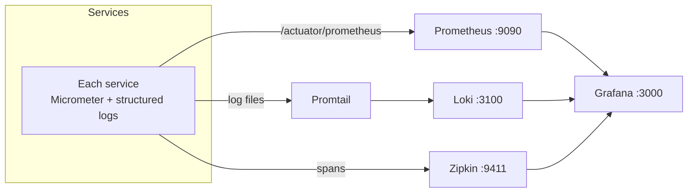

# Observability

The platform ships with the three pillars — **metrics**, **logs**, and **traces** — plus **correlation IDs** that stitch a single request together across every service and Kafka hop. Grafana is the single pane of glass.



## Metrics — Prometheus + Grafana

- Every service exposes Micrometer metrics at `/actuator/prometheus` (one of the three actuator endpoints left open — see [Security](https://github.com/CRV96/booking_platform/blob/main/SECURITY.md)).
- **Prometheus** (`infrastructure/prometheus/prometheus.yml`) scrapes each service on its HTTP port and stores the time series.
- **Grafana** (`http://localhost:3000`) auto-provisions its datasources and dashboards from `infrastructure/grafana/provisioning/` — including a platform overview dashboard and an analytics dashboard — so charts are present on first boot with no manual import.

## Logs — Loki + Promtail

- Services write **structured logs** with the correlation id and service name in every line (`ApplicationLogger` from [`common-core`](shared-modules)).
- **Promtail** (`infrastructure/promtail/promtail.yml`) tails the log files and ships them to **Loki**.
- Explore logs in Grafana → **Explore → Loki**. Useful LogQL:

```logql
{service="booking-service"}                       # all logs from one service
{level="ERROR"}                                   # errors across all services
{service="payment-service"} |= "outbox"           # search inside messages
{correlationId="<id>"}                            # one request across all services
```

> The `LOG_PATH` env var must point at the repo root so Promtail can mount the service log files — otherwise Loki shows nothing (console output still works). See [Installation → Environment Variables](INSTALLATION).

## Traces — Zipkin

- Services report spans to **Zipkin** (`http://localhost:9411`), giving a timeline view of a request as it crosses gRPC boundaries.
- Traces and logs share the correlation id, so you can pivot from a slow trace to its log lines.

## Correlation IDs — the thread through everything

A correlation id is assigned per request at the [gateway](graphql-gateway) and propagated:

- across **gRPC** via metadata interceptors → `CorrelationIdContext`,
- across **Kafka** via producer/consumer interceptors → message headers,
- into **every log line** via the logging MDC.

Filtering Grafana/Loki by one correlation id reveals the complete path of a request — gateway → services → event consumers (tickets, email, analytics). The plumbing lives in [`common-core`](shared-modules) and [`common-events`](shared-modules); the rationale is in [Communication patterns](communication-patterns).

## Health & dead letters

- **Health:** `/actuator/health` on each service (used by Docker/K8s probes and the [Eureka](eureka-service) dashboard).
- **Dead-letter topics:** failed Kafka messages land on `<topic>-dlt`; browse and replay them in **Kafka UI** (`http://localhost:8085`).

## Quick links (Docker)

| Tool | URL |
|------|-----|
| Grafana | http://localhost:3000 |
| Prometheus | http://localhost:9090 |
| Zipkin | http://localhost:9411 |
| Kafka UI | http://localhost:8085 |
| MailHog | http://localhost:8025 |

## Related

- [Installation → Observability Stack](INSTALLATION) · [Communication patterns](communication-patterns) · [CI/CD](ci-cd)
