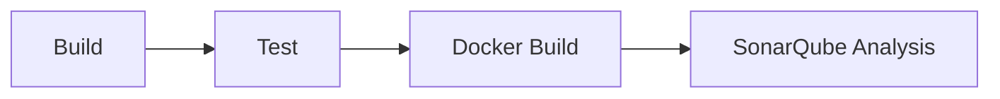

# CI/CD

Two GitHub Actions workflows: **`ci.yml`** validates every push and pull request, and **`sync-wiki.yml`** publishes this documentation to the GitHub Wiki.

## CI pipeline — `.github/workflows/ci.yml`

Runs on every push to `main` and every pull request targeting `main`. Four sequential jobs:

| Job | Does | Notes |
|-----|------|-------|
| **Build** | `mvn clean compile -B` | Java 21 (Temurin), Maven cache |
| **Test** | `mvn clean verify -B` | Unit + integration tests (Testcontainers) with JaCoCo; uploads `target/` artifacts |
| **Docker Build** | Builds `user-service` via the shared `Dockerfile.service` | Smoke test that the shared image builds |
| **SonarQube** | `mvn sonar:sonar` → SonarCloud | Uploads coverage + static analysis; needs `SONAR_TOKEN`, `SONAR_ORGANIZATION`, `SONAR_PROJECT_KEY` secrets. Skipped for fork PRs without secrets |

Each job downloads only what it needs (the Sonar job reuses the Test job's build output artifact), keeping the pipeline fast.

### Running the quality gate locally

The Compose stack includes a SonarQube container (`http://localhost:9000`); `infrastructure/sonarqube/run-sonar.sh` runs the same analysis against it. See [Installation → SonarQube](INSTALLATION).

## Wiki publishing — `.github/workflows/sync-wiki.yml`

**`docs/wiki/` is the source of truth; the GitHub Wiki is a mirror.** The workflow publishes repo → wiki, never the reverse.

- **Triggers:** a push to `main` touching `docs/wiki/**` (or the workflow itself), or a manual run from the Actions tab.
- **How:** it clones the wiki's own git repo (`<repo>.wiki.git`) and `rsync -a --delete`s `docs/wiki/` into it, so additions, edits, **and deletions/renames** all propagate. It excludes `.git`, `.DS_Store`, and `Home.md` (the wiki's Home page is managed directly on the wiki), then commits and pushes.

### Authoring rules for wiki pages

Because the GitHub Wiki is a flat page space keyed by **filename**:

- **Every page needs a globally unique basename** — `overview.md` can exist only once across all folders. Prefer descriptive names (`architecture-overview.md`, not `overview.md`).
- **Links use the slug** (filename without `.md`): `[booking-service](booking-service)`, not a relative path with `.md`.
- **`_Sidebar.md`** defines the navigation shown on every wiki page — update it when adding a page.
- **Mermaid in flowchart edge labels can't contain parentheses** — write `|gRPC, JWT forwarded|`, not `|gRPC (JWT forwarded)|`. Parentheses are fine inside quoted node labels.

## Related

- [Docker deployment](docker-deployment) · [Releases](releases) · [Installation](INSTALLATION)
