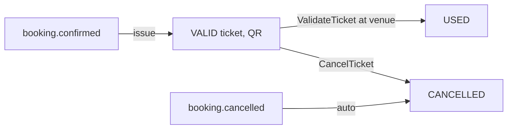

# ticket-service

Issues and manages **tickets**. Tickets are generated automatically when a booking is confirmed and cancelled automatically when the booking is cancelled, so ticket status is always consistent with booking status. Each ticket carries a QR-encodable ticket number for entry validation.

| Property | Value |
|----------|-------|
| HTTP port | 8088 |
| gRPC port | 9096 |
| Store | MongoDB `ticketdb` |
| Consumes | `events.booking.confirmed`, `events.booking.cancelled` |

## gRPC API

`ticket/ticket_service.proto`: `GetMyTickets`, `GetTicketsByBooking`, `GetTicketsByUser`, `GetTicketByNumber`, `ValidateTicket`, `CancelTicket`.

- **Customer:** `GetMyTickets` (from the JWT subject).
- **Organizer (`employee`):** `GetTicketsByBooking`, `GetTicketsByUser`, `GetTicketByNumber`, `ValidateTicket` (mark USED at the door), `CancelTicket`.

## Package layout

`config · constants · document · dto · exception · grpc · mapper · messaging · properties · repository · service · validation`

- **`document`** — `TicketDocument` (ticket number, QR data, event/booking/user ids, seat category and number, status, event title).
- **`messaging`** — the Kafka consumers that drive the lifecycle.

## Ticket lifecycle

- On **`events.booking.confirmed`**, one ticket per seat is generated with a unique ticket number.
- On **`events.booking.cancelled`**, the booking's tickets are moved to `CANCELLED`.
- At the venue, organizers call **`ValidateTicket`** (via the frontend scanner) to mark a ticket `USED`; re-validation is rejected.

The frontend renders the ticket number as a **QR code** in *My Tickets*, which the organizer scanner reads back and validates. See [Frontend guide](frontend-guide).

## Related

- [booking-service](booking-service) · [notification-service](notification-service) · [Application flows](application-flows)
